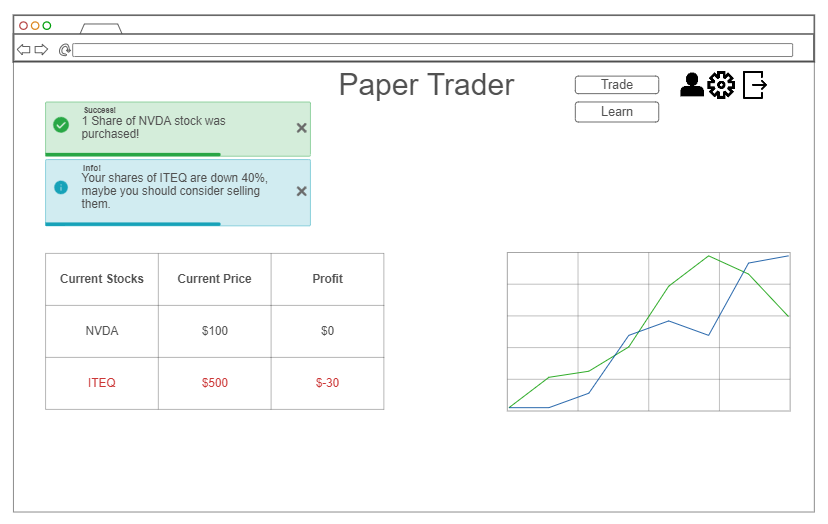
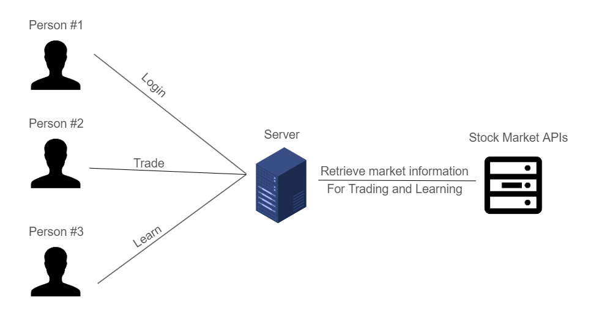

# Paper Trading
This applications serves to help people understand the logistics of the stock market, without having to invest capital and run the risk of losing money.

## Elevator Pitch
There are many people today who don't know much, or anything, about the stock market. Many are scared to use it because they could lose money, or because it seems too difficult to understand. However, it is vital in today's economy to understand the stock market and how to make educated guesses for a secure tomorrow. This applications helps users understand the different types of stocks and ETFs they can buy, and what all the data about them means. Not only can users learn about each stock and ETF, but can also use fake, or paper, money to experiment with the market itself. This hands-on approach will help everyone, especially youth, to invest more time into the stock market for a brighter tomorrow.

### Design

### Key Features
* Secure, encrypted login
* Ability to buy/sell stocks from NYSE and NASDAQ markets
* Displays owned stocks and their profit
* Teaches how to understand the information from a stock
* Alerts users if one of their stocks is losing money

### Technologies
The following is how I will use the required technologies for this website
* **HTML** - Use correct HTML structure for applicaton, with 4 pages. One for the home screen, one for trading (Trade), another for logging in (Log in), and lastly one for stock market information (Learn)
* **CSS** - Application styling that allows the website to look good on different devices with different aspect ratios (phone vs. computer)
* **React** - Provides login, buying/selling stocks, displays current stock data.
* **Web Service** - Backend service with endpoints for:
    - Retrieving stock information
    - Buying stocks
    - Selling stocks
    - Showing market information
* **Database/login** - Stores users information, such as logins, stocks, and profit. All passwords will be encrypted with BCrypt
* **WebSocket** - Realtime data from the stock market (changes in market prices)