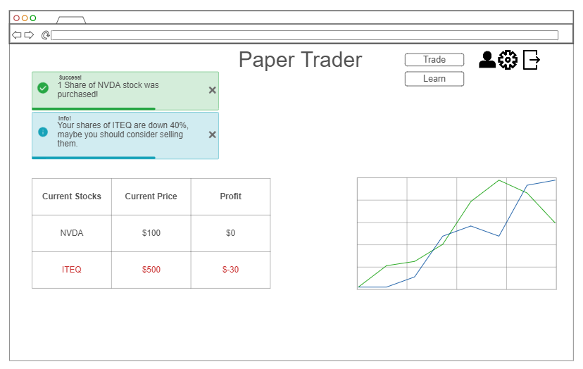
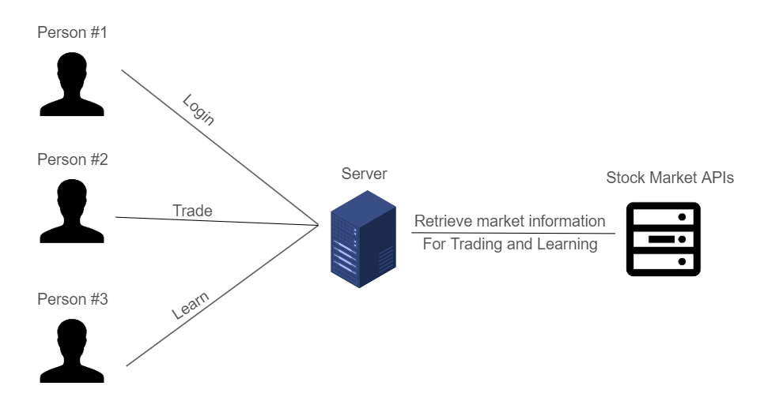

# Paper Trading
This applications serves to help people understand the logistics of the stock market, without having to invest capital and run the risk of losing money.

## Elevator Pitch
There are many people today who don't know much, or anything, about the stock market. Many are scared to use it because they could lose money, or because it seems too difficult to understand. However, it is vital in today's economy to understand the stock market and how to make educated guesses for a secure tomorrow. This applications helps users understand the different types of stocks and ETFs they can buy, and what all the data about them means. Not only can users learn about each stock and ETF, but can also use fake, or paper, money to experiment with the market itself. This hands-on approach will help everyone, especially youth, to invest more time into the stock market for a brighter tomorrow.

### Design

Here is a rough sketch of the application itself in the home page.

And here is how the users connect with the backend server and the stock market API.

### Key Features
* Secure, encrypted login
* Ability to buy/sell stocks from NYSE and NASDAQ markets
* Displays owned stocks and their profit
* Teaches how to understand the information from a stock
* Alerts users if one of their stocks is losing money

### Technologies
The following is how I will use the required technologies for this website
* **HTML** - Use correct HTML structure for applicaton, with 4 pages. One for the home screen, one for trading (Trade), another for logging in (Log in), and lastly one for stock market information (Learn)
* **CSS** - Application styling that allows the website to look good on different devices with different aspect ratios (phone vs. computer)
* **React** - Provides login, buying/selling stocks, displays current stock data.
* **Web Service** - Backend service with endpoints for:
    - Retrieving stock information
    - Buying stocks
    - Selling stocks
    - Showing market information
* **Database/login** - Stores users information, such as logins, stocks, and profit. All passwords will be encrypted with BCrypt
* **WebSocket** - Realtime data from the stock market (changes in market prices)

### HTML Deliverable
The following is the structure of the HTML used in the website
- [x] **4 HTML pages**: Home, Trade, Learn, and Login
- [x] **Header/Footer**: header and footer HTMl files are in layouts folder (loaded by JS)
- [x] **Text**: Stocks are represented by a textual description, including different important aspects
- [x] **Images**: A favicon image is used for the website, as well as historic stock pictures
- [x] **DB/Login**: Input boxes for ticker symbols, user login, as well as display what stocks the user has.
- [x] **WebSocket**: The market price of a stock, alongside current price of all the user's stocks are displayed in realtime.

### CSS Deliverable
The following describes what has been achieved using CSS
- [x] **Bootstrap 5**: Uses the newest Bootstrap 5 and flexboxes for better user interaction.
- [x] **Header, Footer, Main content, Sections**
- [x] **Navigation Elements**: Includes a header that has hightlighted your current page, with hyperlinks to go to each page.
- [x] **Responsive to Window Sizing**: Header/footer disapear if the window is too small, alongsize resizing text on the learn page
- [x] **Application Elements**: The elements fill up the entire page, without leaving whitespace, with good contrast and seperation between sections
- [x] **Application Text Content**: The forms are consistent, however as of now they do not have custom error messages for invalid submitions
- [x] **Application Images**: The favicon image is used to link to the root page. Additionally, there are images to help reader understand stocks on the learn page.

### React Deliverable
The following describes what has been done using React, Vite, and Routers
- [x] **Bundled and Transpiled**: Done.
- [x] **Components**: Login/signup, Logout, buy/sell are all components with mocks for login/WebSocket (all currently use localStorage)
    - [x] **Login**: Allows login, which grants access to the user's portfolio and trade pages.
    - [x] **Database**: Using localStorage, a count is kept of the user's positions and amount of shares. NOTE: In lack of access to an official stock API, the 'profits' and 'price' are merely calculated with Math.random(), and all ticker symbols are considered "valid".
    - [x] **Application logic**: Buying/selling accurately displays user's positions, with errors if the order cannot be completed, and redirection if the user is not authorized to view a certain page.
- [x] **Router**: Routing between pages is done with the BrowserRouter, Router, and NavLink components
- [x] **Hooks**: Using `useState`: each users' stocks are displayed and for the use of logins.